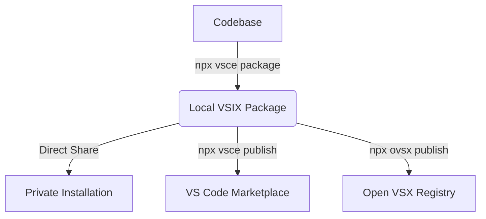

# Ghost Persona: Hosting & Production Roadmap Guide

This guide details how to bundle, package, and host the **Ghost Persona** VS Code extension so developers can install and run it in their IDEs. It also outlines the critical structural features remaining now that the Story Global Wallet companion app has been designed.

---

## 1. Hosting & Publishing Your VS Code Extension

VS Code extensions are packaged as self-contained `.vsix` bundles and can be shared either publicly through marketplaces or privately.



### Option A: The Official Visual Studio Marketplace (Public)
To make your extension searchable directly inside the VS Code Extensions tab:

1. **Create an Azure DevOps Organization**:
   - Go to [Azure DevOps](https://dev.azure.com) and create a free account.
   - Generate a **Personal Access Token (PAT)**:
     - Select **All accessible organizations** under Organization.
     - Set the scope to **Marketplace > Publish** (Read & Write permissions).
     - Copy the PAT safely.

2. **Set Up a Publisher Profile**:
   - Go to the [VS Code Marketplace Publisher Console](https://marketplace.visualstudio.com/manage).
   - Create a publisher account using a unique ID (e.g., `meru`). Make sure this matches the `"publisher": "meru"` field in your [package.json](file:///home/meru/remix-button/package.json#L9).

3. **Install VSCE Tooling**:
   Install the official Microsoft packaging tool:
   ```bash
   npm install -g @vscode/vsce
   ```

4. **Login and Package**:
   Inside the root of `/home/meru/remix-button`, authenticate and generate your bundle:
   ```bash
   vsce login <your-publisher-name>  # Paste your PAT when prompted
   vsce package
   ```
   This will generate a file named `ghost-persona-1.0.0.vsix` in your root folder.

5. **Publish to the Marketplace**:
   Publish it instantly to the web:
   ```bash
   vsce publish
   ```

---

### Option B: The Open VSX Registry (For VSCodium, Gitpod, Eclipse Theia)
To support developers using open-source variants of VS Code that do not access Microsoft’s proprietary marketplace:

1. Create an account at [open-vsx.org](https://open-vsx.org).
2. Obtain an access token.
3. Install the publisher CLI tool:
   ```bash
   npm install -g ovsx
   ```
4. Authenticate and publish your pre-built `.vsix` file:
   ```bash
   ovsx publish ghost-persona-1.0.0.vsix -t <your-token>
   ```

---

### Option C: Private Enterprise Distribution (Direct Sharing)
If you want to share the extension with a beta group or team without publishing it to the web:

1. Package the extension:
   ```bash
   vsce package
   ```
2. Distribute the `ghost-persona-1.0.0.vsix` file directly via email, Slack, or secure storage.
3. Instruct users to install it in their local VS Code by:
   - Clicking on the **Extensions icon (Ctrl+Shift+X)**.
   - Clicking the `...` menu in the top-right of the extensions panel.
   - Selecting **Install from VSIX...** and uploading your bundle.

---

## 2. Production Roadmap: Remaining Implementation Steps

Now that the companion app is built, you need to transition the extension architecture from a local-development structure to a production-ready model.

### 📋 The Technical Checklist

| Stage | Task | Priority | Status | Description |
| :--- | :--- | :--- | :--- | :--- |
| **Configuration** | **Default Companion URL** | 🔴 High | `[ ]` | Hardcode your deployed production Vercel/Netlify URL into the configuration defaults of `package.json`. |
| **Security** | **Decoupled Relayer / Signer** | 🔴 High | `[ ]` | Remove `GHOST_SOFTWARE_PRIVATE_KEY` dependency from the user's runtime and establish a secure relayer. |
| **Performance**| **Debounce & Cache Policies** | 🟡 Medium | `[ ]` | Prevent writing transaction fees to CDR on every single typing keystroke by optimizing the write intervals. |
| **UX & Branding**| **Webview Visual Polish** | 🟡 Medium | `[ ]` | Update the extension's activity bar sidebar with a premium dark-mode dashboard matching the companion's aesthetics. |
| **Clean Up** | **Packaging Ignore File** | 🟢 Low | `[ ]` | Ensure test scripts, local `.ghost` files, and raw `.env` configs are completely excluded from the package bundle. |

---

### 🔍 Next Steps Walkthrough

> [!IMPORTANT]
> **Refactoring the CDR Private Key Requirement (Security Issue #1)**
> Right now, when live mode is activated, the extension requires the user's environment to contain `GHOST_SOFTWARE_PRIVATE_KEY` to interact with `@piplabs/cdr-sdk` and submit on-chain transactions. 
> 
> *In production, you cannot expect users to supply their hot wallet private key to an editor extension.*
> 
> **How to fix this**:
> - Move transaction writes to a **Backend Relayer Service**. The VS Code extension sends the threshold-encrypted key bundle and the user's signature to your backend, and your backend submits the transaction to the Story CDR, paying the gas fee.
> - Or integrate EIP-1193 session-key delegation during the initial Global Wallet flow, allowing the extension to sign transactions using a secure, low-privilege temporary key created during handshake.

> [!TIP]
> **Optimizing File Watcher Sync Frequency**
> The file watcher [watcher.ts](file:///home/meru/remix-button/extension/src/watcher.ts#L63-L75) currently flushes and syncs to disk exactly **3 seconds** after changes stabilize. 
> In mock mode, this is fine. In live CDR mode, writing to the blockchain on every single save is too expensive.
> **How to fix this**:
> - Increase the flush debounce time to **5-10 minutes**, or only push updates when the user closes their window, commits code, or manually clicks a "Sync Secure State" button in the VS Code sidebar.

> [!WARNING]
> **VSCE Ignore Pattern**
> Ensure that your packaging manifest does not upload development secrets. Create a `.vscodeignore` file containing:
> ```text
> .env
> .ghost/**
> test-*.ts
> companion/**
> tsconfig.json
> node_modules/**
> ```
